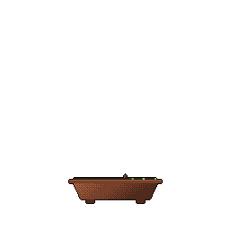

<kbd>

  

</kbd>

. . . editing README

  

<!--

About!
- started my programming journey in 2020 during COVID due to boredom, interest in Math and too much time spent on the PC
- I started with Java, studied a bit of Racket and did a computer vision team project in Python and stuck with Java for a while
- started my studies in University of Plovdiv where I learned about the joys of .NET
- also started SoftUni and am almost done, currently studying DevOps and hoping to start working in the field soon!
- currently mostly working with .NET and Java, but am open to Python projects
- I am extremely hard working and, as my bio truthfully states, very, very stubborn. I will do what it takes to learn anything and it will only cost me sleep and (probably) my sanity. I love Math and puzzles, so programming scratches the right spots in my brain.

Currently working on:
- mini games on Godot engine mostly to learn how game dev works
- personal project with Java that could've been on Python.. like a meeting that could've been an email
- website for our family's rental place, made solely with HTML and CSS as no backend is required

You can reach me on LinkedIn: I am open to working in the industry and learning as much as I can from any specialist that will take me in. 

Fun facts!
- crochet
- huge gaming nerd
- i can't watch horror movies but I only read horror and Lovecraftian short stories

-->
